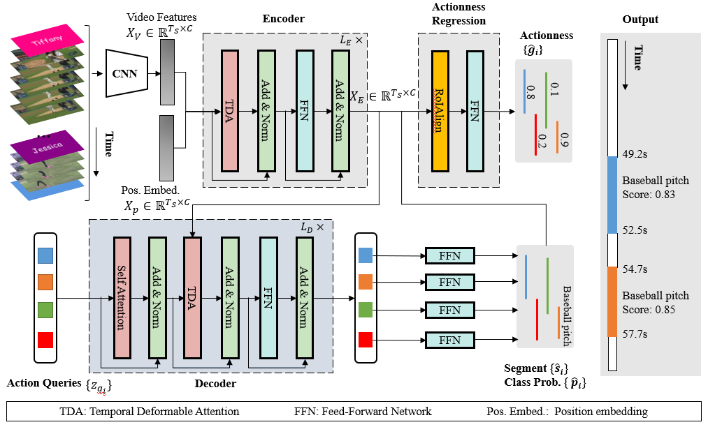

# TadTR: End-to-end Temporal Action Detection with Transformer

By [Xiaolong Liu](https://github.com/xlliu7), [Qimeng Wang](https://scholar.google.com/citations?user=hi7AeE8AAAAJ), [Yao Hu](https://scholar.google.com/citations?user=LIu7k7wAAAAJ), [Xu Tang](https://scholar.google.com/citations?user=grP24aAAAAAJ), [Song Bai](http://songbai.site), [Xiang Bai](https://scholar.google.com/citations?user=UeltiQ4AAAAJ).

This repo holds the code for TadTR, described in the technical report:
[End-to-end temporal action detection with Transformer](https://arxiv.org/abs/2106.10271)

## Introduction

TadTR is an end-to-end Temporal Action Detection TRansformer. It has the following advantages over previous methods:
- Simple. It adopts a set-prediction pipeline and achieves TAD with a single network.
- Flexible. It removes hand-crafted design such as anchor setting and NMS.
- Sparse. It produce very sparse detections, thus requiring lower computation cost.



## Updates
[2021.9.1] Add demo code.

## TODOs
- [x] add model code
- [ ] add inference code
- [ ] add training code
- [ ] support training/inference with video input

## Main Results
- HACS Segments

|Method|Feature|mAP@0.5|mAP@0.75|mAP@0.95|Avg. mAP|Model|
| :----: |:----: | :--: | :----: | :---: | :----: |:----: |  
|TadTR|I3D RGB|45.16| 30.70 |11.78 |30.83|[OneDrive]|


- THUMOS14

|Method|Feature|mAP@0.3|mAP@0.4|mAP@0.5|mAP@0.6|mAP@0.7|Avg. mAP|Model|
| :----: |:----: | :--: | :----: | :---: | :----: |:----: | :----: |:----: |
|TadTR|I3D 2stream|64.8| 59.5| 50.6| 38.2| 26.5| 47.9|[OneDrive]
|TadTR-CWF*|I3D 2stream| 67.1 |61.1| 52.0| 39.9| 26.2 |49.3||
|TadTR-CWF + P-GCN|I3D 2stream|71.7| 65.2| 55.7| 44.0| 29.3 |53.2||


\* CWF: cross-window fusion, a simple strategy used for inference.

- ActivityNet-1.3

|Method|Feature|mAP@0.5|mAP@0.75|mAP@0.95|Avg. mAP|Model|
| :----: |:----: | :--: | :----: | :---: | :----: |:----: | 
|TadTR+BMN|TSN 2stream|50.51| 35.35| 8.18| 34.55|[OneDrive]|


## Install
### Requirements

* Linux, CUDA>=9.2, GCC>=5.4
  
* Python>=3.7

  
* PyTorch>=1.5.1, torchvision>=0.6.1 (following instructions [here](https://pytorch.org/))
  
* Other requirements
    ```bash
    pip install -r requirements.txt
    ```
### Compiling CUDA extensions

```bash
cd model/ops;

# If you have multiple installations of CUDA Toolkits, you'd better add a prefix
# CUDA_HOME=<your_cuda_toolkit_path> to specify the correct version. 
python setup.py build_ext --inplace
```

### Run a quick test
```
python demo.py
```

## Data Preparation
To be updated.

## Training
Run the following command
```
bash scripts/train.sh DATASET
```

## Testing
```
bash scripts/test.sh DATASET WEIGHTS
```

## Acknowledgement
The code is based on the [DETR](https://github.com/facebookresearch/detr) and [Deformable DETR](https://github.com/fundamentalvision/Deformable-DETR). We also borrow the implementation of the RoIAlign1D from [G-TAD](https://github.com/Frostinassiky/gtad). Thanks for their great works.

## Citing
```
@article{liu2021end,
  title={End-to-end Temporal Action Detection with Transformer},
  author={Liu, Xiaolong and Wang, Qimeng and Hu, Yao and Tang, Xu and Bai, Song and Bai, Xiang},
  journal={arXiv preprint arXiv:2106.10271},
  year={2021}
}
```

## Contact

For questions and suggestions, please contact Xiaolong Liu at "liuxl at hust dot edu dot cn".
